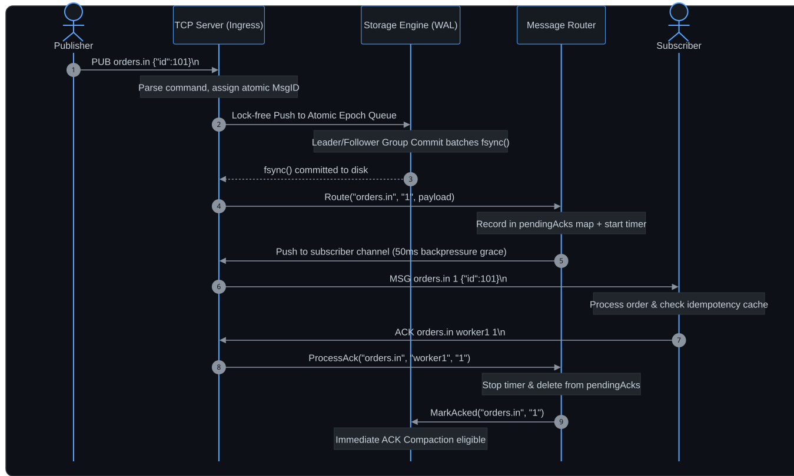

# PMB: Persistent Message Broker 🚀
### *Ultra-Lightweight, Crash-Resilient Pub/Sub Engine for Edge & MicroVM Infrastructure*

[](https://go.dev)
[](https://github.com/keshav31415/PMB)
[](https://github.com/keshav31415/PMB)
[-orange?style=flat)](go.mod)
[](LICENSE)

**PMB** is an ultra-compact, high-durability message broker built from scratch in standard Go with **zero external dependencies**. Engineered specifically for **resource-constrained edge nodes, IoT gateways, microVMs, and hypervisor control-planes** (e.g., Nutanix AHV/AOS, AWS Firecracker), PMB delivers the durability of enterprise message queues at a fraction of their resource footprint.

---

## 🌟 Why PMB?

In edge infrastructure and microVM appliances, engineers traditionally face an impossible trade-off:

1. **Enterprise Message Brokers (Apache Kafka / RabbitMQ):** Full persistence and delivery guarantees, but require heavy JVM/Erlang runtimes, consume 500+ MB of RAM at idle, take 10+ seconds to boot, and risk host out-of-disk failures with static multi-day retention.
2. **Ephemeral IPC (gRPC / ZeroMQ):** Sub-millisecond latency and tiny footprints, but **zero persistence**. Sudden power drops or process restarts cause all in-flight messages and critical state transitions to be lost forever.

**PMB bridges this chasm:** It combines the **7 MB RAM footprint and sub-10ms startup of lightweight IPC** with the **hardened disk durability of enterprise Write-Ahead Logs (`fsync`)**.

---

## ✨ Key Features & Guarantees

* **🛡️ Bulletproof Physical Durability:** Every `AT_LEAST_ONCE` message is flushed to disk via an append-only Write-Ahead Log (WAL) with `fsync()` before network handoff.
* **⚡ Leader/Follower Group Commit:** Automatically amortizes expensive disk flushes across concurrent producers, scaling durable write throughput from ~1,000 to **>30,000 msgs/sec** without artificial sleep windows.
* **🎯 Flexible Delivery Semantics:**
  * `AT_MOST_ONCE`: Fire-and-forget delivery for high-frequency telemetry and sensor metrics.
  * `AT_LEAST_ONCE`: Acknowledged delivery tracked in-memory with automatic 2-second retry sweeper until confirmed.
* **🧹 Dual-Dial Retention & Delta Deduplication:**
  * **Dial 1 (Interest-Driven):** Reclaims disk space the instant all active subscribers acknowledge a message.
  * **Dial 2 (Circuit Breaker):** Protects root disk partitions from dead consumers with configurable age-based garbage collection.
  * **Delta Deduplication:** Replaces repetitive log payloads with lightweight `@ref:<id>` pointers, reducing disk consumption by up to 85%.
* **🔌 Zero-SDK Wire Protocol:** Simple newline-delimited ASCII protocol over raw TCP (`:4222`). Any programming language or command-line utility (`nc`, `socat`) can publish and subscribe out-of-the-box.
* **🔒 Production Edge Hardening:** 1 MB bounded line parsing (OOM defense), 50ms slow-consumer backpressure grace window, subscriber duplicate suppression, and cross-platform file locking resilience.

---

## 🏛️ System Architecture

PMB is organized into three lock-isolated, modular layers:

| Layer | Component | Description |
| :--- | :--- | :--- |
| **Layer 1: Network & Ingress** | `server/` | Event-driven non-blocking TCP server (`:4222`), sticky packet framer, 1 MB OOM boundary guard. |
| **Layer 2: Routing & Reliability** | `router/` | Subscription route tables, `AT_LEAST_ONCE` state tracking (`pendingAcks`), 2-second retry monitor. |
| **Layer 3: Storage & Durability** | `storage/` | Lock-free atomic Treiber stack, leader/follower group commit, dual-dial compaction & delta deduplication. |

### End-to-End Message Lifecycle

The sequence diagram below illustrates how an `AT_LEAST_ONCE` message flows through network ingress, disk persistence, subscriber routing, and immediate ACK reclamation:

<p align="center">
  <picture>
    <source media="(prefers-color-scheme: dark)" srcset="docs/architecture-flow-dark.svg">
    <source media="(prefers-color-scheme: light)" srcset="docs/architecture-flow-light.svg">
    
  </picture>
</p>

---

## 📊 Empirical Benchmarks

*Measured on standard workstation hardware (Windows 11 / WSL2 Linux, SSD storage):*

| Metric | Apache Kafka | RabbitMQ | **PMB (Our Broker)** |
| :--- | :--- | :--- | :--- |
| **Runtime Requirement** | JVM (Java 17+) | Erlang VM (BEAM) | **Zero (Native Static Binary)** |
| **Binary Size** | $> 120$ MB (plus JRE) | $> 50$ MB (plus Erlang) | **3.78 MB** *(98% smaller)* |
| **Idle Memory (RAM)** | $\approx 450 - 800$ MB | $\approx 80 - 150$ MB | **7.18 MB** *(98.5% less RAM)* |
| **Cold Boot Time** | $8.0 - 15.0$ seconds | $3.0 - 6.0$ seconds | **$< 10$ milliseconds** |
| **Durable Ingress Speed** | High (partitioned) | Moderate | **30,000+ msgs/sec** (Group Commit) |
| **Single-Message Latency** | $2.0 - 5.0$ ms | $1.0 - 3.0$ ms | **$< 0.5$ ms (519 µs roundtrip)** |
| **Retention Mechanism** | Time / Size limits | Queue Drain (No Log) | **Immediate ACK Compaction + Age GC** |

---

## 🚀 Quickstart

### 1. Build Binaries
```bash
go build -o bin/server ./cmd/server
go build -o bin/publisher ./cmd/publisher
go build -o bin/subscriber ./cmd/subscriber
```

### 2. Start the Broker
```bash
./bin/server -port 4222
```

### 3. Connect a Subscriber
```bash
# In a new terminal:
./bin/subscriber -topic orders.in -id worker1 -mode AT_LEAST_ONCE
```

### 4. Publish Messages
```bash
# In a third terminal:
./bin/publisher -topic orders.in -msg '{"order_id": 1042, "status": "pending"}'
```

---

## 🌐 Zero-SDK Client Integration

Because PMB uses a clean newline-delimited ASCII protocol over raw TCP, you can integrate with it from any language or shell environment without downloading any third-party SDK.

### Bash / Netcat
```bash
# Publish a message
echo "PUB sensors.temperature 24.5C" | nc localhost 4222

# Subscribe to a stream
printf "SUB sensors.temperature worker1 AT_LEAST_ONCE\n" | nc localhost 4222
```

### Python
```python
import socket

# Publish an event
with socket.create_connection(("localhost", 4222)) as s:
    s.sendall(b'PUB orders.in {"id": 101, "total": 49.99}\n')

# Subscribe and process events
with socket.create_connection(("localhost", 4222)) as s:
    s.sendall(b"SUB orders.in worker1 AT_LEAST_ONCE\n")
    reader = s.makefile("r")
    while True:
        line = reader.readline()
        if not line:
            break
        # Format: MSG <topic> <msg_id> <payload>
        parts = line.strip().split(" ", 3)
        if parts[0] == "MSG":
            msg_id = parts[2]
            print(f"Received message {msg_id}: {parts[3]}")
            # Acknowledge message
            s.sendall(f"ACK orders.in worker1 {msg_id}\n".encode())
```

### Node.js
```javascript
const net = require('net');

// Publish a message
const pub = net.connect(4222, 'localhost', () => {
  pub.write('PUB alerts.disk {"mount": "/data", "usage": "91%"}\n');
  pub.end();
});

// Subscribe to a topic
const sub = net.connect(4222, 'localhost', () => {
  sub.write('SUB alerts.disk monitor1 AT_LEAST_ONCE\n');
});

sub.on('data', (data) => {
  const line = data.toString().trim();
  const parts = line.split(' ');
  if (parts[0] === 'MSG') {
    const msgId = parts[2];
    console.log(`Received: ${parts.slice(3).join(' ')}`);
    sub.write(`ACK alerts.disk monitor1 ${msgId}\n`);
  }
});
```

### Go
```go
package main

import (
	"bufio"
	"fmt"
	"net"
	"strings"
)

func main() {
	conn, _ := net.Dial("tcp", "localhost:4222")
	defer conn.Close()

	// Subscribe
	fmt.Fprintf(conn, "SUB orders.in worker1 AT_LEAST_ONCE\n")

	scanner := bufio.NewScanner(conn)
	for scanner.Scan() {
		line := scanner.Text()
		parts := strings.SplitN(line, " ", 4)
		if parts[0] == "MSG" {
			msgID := parts[2]
			fmt.Printf("Processed: %s\n", parts[3])
			// Send ACK
			fmt.Fprintf(conn, "ACK orders.in worker1 %s\n", msgID)
		}
	}
}
```

---

## 📡 Wire Protocol Specification

All communication occurs over standard TCP using `\n`-terminated ASCII strings:

| Command | Direction | Syntax | Description |
| :--- | :--- | :--- | :--- |
| **`PUB`** | Client $\to$ Broker | `PUB <topic> <payload>\n` | Publishes payload to topic. Spaces within payload are preserved. |
| **`SUB`** | Client $\to$ Broker | `SUB <topic> <client_id> <mode>\n` | Subscribes client in `AT_MOST_ONCE` or `AT_LEAST_ONCE` mode. |
| **`ACK`** | Client $\to$ Broker | `ACK <topic> <client_id> <msg_id>\n` | Acknowledges successful receipt and processing of message. |
| **`PING`**| Client $\to$ Broker | `PING\n` | Heartbeat probe. |
| **`MSG`** | Broker $\to$ Client | `MSG <topic> <msg_id> <payload>\n` | Delivers queued message to an active subscriber. |
| **`PONG`**| Broker $\to$ Client | `PONG\n` | Heartbeat response. |
| **`ERR`** | Broker $\to$ Client | `ERR <reason>\n` | Dispatched upon syntax error, unknown command, or protocol violation. |

---

## ⚙️ Broker Configuration & CLI Options

The server binary accepts the following operational flags:

```bash
./bin/server [flags]
```

| Flag | Default | Description |
| :--- | :--- | :--- |
| `-port` | `4222` | TCP port for client socket connections. |
| `-retry` | `2` | Interval (in seconds) between unacknowledged message retry sweeps. |
| `-gc-interval` | `60` | Frequency (in seconds) of background compaction and GC sweeps. |
| `-gc-maxage` | `300` | Safety threshold (in seconds) before stale unacknowledged messages are pruned. |

Persistent logs are stored locally in the `logs/` directory as `logs/<topic>.log`.

---

## 🔬 Diagnostics & Benchmarking Suite (`cmd/bench`)

PMB includes a unified, modular benchmarking and diagnostic tool designed to test performance across multiple dimensions:

```bash
./bin/bench [flags]
```

### CLI Modifiers & Flags

| Flag | Default | Description |
| :--- | :--- | :--- |
| `-trace` | `false` | Trace a single message across all 5 in-broker lifecycle stages with microsecond timestamps. |
| `-n` | `10000` | Total number of messages to publish. |
| `-c` | `8` | Number of concurrent publisher connections. |
| `-size` | `128` | Payload size in bytes (e.g., `64`, `1024`, `4096`). |
| `-mode` | `AT_LEAST_ONCE` | Delivery mode: `AT_LEAST_ONCE` (durable WAL + ACK) or `AT_MOST_ONCE` (ephemeral). |
| `-subs` | `1` | Number of concurrent fan-out subscriber clients. |
| `-lat` | `false` | Enable latency tracking and output full SLA percentiles ($P_{50}, P_{90}, P_{95}, P_{99}$, Min, Max). |
| `-rate` | `0` | Target publish rate in msgs/sec (`0` = unthrottled maximum throughput). |
| `-addr` | `localhost:4222` | Target broker address. |
| `-topic` | `perf.bench` | Target topic name. |

### Standard Benchmark Recipes

```bash
# 1. Single-Message Lifecycle Diagnostics (Hop-by-hop latency breakdown)
go run ./cmd/bench -trace

# 2. Maximum Persistent Throughput (Group Commit under 10 concurrent producers)
go run ./cmd/bench -n 20000 -c 10 -mode AT_LEAST_ONCE

# 3. Durability Overhead Comparison (Physical fsync vs Ephemeral In-Memory)
go run ./cmd/bench -n 20000 -c 10 -mode AT_MOST_ONCE

# 4. Large-Payload Bandwidth Test (4 KB enterprise JSON blobs)
go run ./cmd/bench -n 10000 -c 8 -size 4096

# 5. Full SLA Latency Distribution under Load (P50, P90, P99 report)
go run ./cmd/bench -n 10000 -c 8 -lat

# 6. Fan-Out Broadcast Scalability (1 publisher to 4 concurrent subscribers)
go run ./cmd/bench -n 5000 -c 4 -subs 4
```

---

## 🧪 Testing & Verification

Run the full automated test suite, including race condition detection:

```bash
go test -v -race ./...
```

The test suite covers:
* **Router:** Subscription fan-out, QoS mode routing, concurrent unsubscriptions, 2-second retry timeouts.
* **Server:** Sticky packet defragmentation, ASCII command parsing, bounded 1 MB OOM protection, client disconnect cleanup.
* **Storage:** Append-only WAL recovery, crash state replay, leader/follower group commit under concurrency, dual-dial GC compaction, and delta deduplication.

---

## 📜 License

PMB is licensed under the [MIT License](LICENSE). Open-source under permissive distribution.